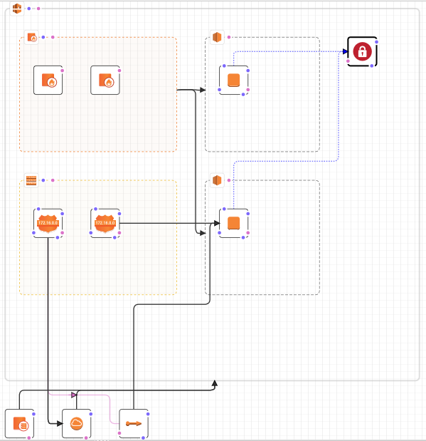
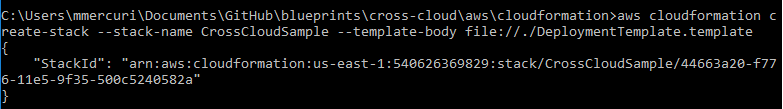
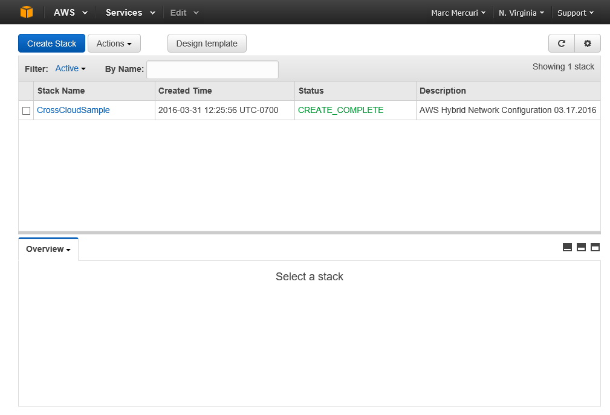

Creating and Uploading a Key Pair
=================================

You’ll create a key pair that will be used when you connect to your created VMs via SSH.

Creating the Template
=====================

Now that you’ve created and deployed the ARM template for Azure, you’ll want to deploy the topology in AWS as well.

Amazon’s approach to automated deployment is their Cloud Formation service. Like Azure Resource Manager, CloudFormation accepts a JSON based template and a JSON based parameters file to deliver consistent deployments.

Creating a Mapping for the AMI
------------------------------

Amazon provides default VM images referred to as Amazon Machine Images or AMIs. The identifiers for these images vary based on the region you’re targeting, so the template includes a mapping section that maps the identifiers for the region-specific AMIs to their associated region.

"Mappings": {

"RegionMap": {

"us-east-1": {

"AMI": "ami-df0607b5"

},

"us-west-1": {

"AMI": "ami-12394b72"

},

"us-west-2": {

"AMI": "ami-37b95057"

}

}

}

Creating the VPC
----------------

The first step is the creation of the Virtual Private Cloud (VPC), which is comparable to a VNET in Microsoft Azure. The template identifies that the VPC should enable DNS support, enable DNS host names and use Cidr Block 192.168.0.0/16.

To make it easier to identify the VPC, a tag is associated with it. The tag is the name of the StackName you provide when calling the create-stack method on the CloudFormation service via . the AWS Command Line Interface (CLI).

Like other resources in the template, you’ll see a Metadata property associated with the VPC. This is used for the visual designer in the AWS Console’s CloudFormation template designer. If you were to cut and paste the template into the designer, it would use this meta-data to create a visual representation of the template.

"vpca75861c3": {

"Type": "AWS::EC2::VPC",

"Properties": {

"CidrBlock": "192.168.0.0/16",

"InstanceTenancy": "default",

"EnableDnsSupport": "true",

"EnableDnsHostnames": "true",

"Tags": \[

{

"Key": "Name",

"Value": { "Ref": "AWS::StackName" }

}

\]

},

"Metadata": {

"AWS::CloudFormation::Designer": {

"id": "044d3ae0-1f8e-4fd1-806d-26a1bf5db6f3"

}

}

}

Creating the Subnets
--------------------

The template then creates two subnets. One is created for the database subnet and is assigned Cidr Block 192.168.1.0/24 and a “Name” tag of “DB Subnet.” The other is assigned to Cidr Block 192.168.0.0/24 and given the “Name” tag of “GW Subnet.” You’ll see that each of them reference back to the VPC that was just created via the VpcId property that referenced the VPC by its name, “vpca75861c3”

 "subnet5066d908": {
--------------------

 "Type": "AWS::EC2::Subnet",
----------------------------

 "Properties": {
----------------

 "CidrBlock": "192.168.1.0/24",
-------------------------------

 "VpcId": {
-----------

 "Ref": "vpca75861c3"
---------------------

 },
---

 "Tags": \[
-----------

 {
--

 "Key": "Name", "Value": "DB Subnet"
------------------------------------

 }
--

 \]
---

 },
---

 "Metadata": {
--------------

 "AWS::CloudFormation::Designer": {
-----------------------------------

 "id": "7ef15fdf-f49b-420c-bb54-18c9ad0f2500"
---------------------------------------------

 }
--

 }
--

 },
---

 "subnet0f6c0b79": {
--------------------

 "Type": "AWS::EC2::Subnet",
----------------------------

 "Properties": {
----------------

 "CidrBlock": "192.168.0.0/24",
-------------------------------

 "VpcId": {
-----------

 "Ref": "vpca75861c3"
---------------------

 },
---

 "Tags": \[
-----------

 {
--

 "Key": "Name", "Value": "GW Subnet"
------------------------------------

 }
--

 \]
---

 },
---

 "Metadata": {
--------------

 "AWS::CloudFormation::Designer": {
-----------------------------------

 "id": "427a743a-90c4-46d3-bc65-489e511b8b97"
---------------------------------------------

 }
--

 }
--

 }
--

Creating the Internet Gateway
-----------------------------

The internet gateway resource is defined next. No special configuration is done on the gateway resource itself.

"igw90ba08f4": {

"Type": "AWS::EC2::InternetGateway",

"Properties": { },

"Metadata": {

"AWS::CloudFormation::Designer": {

"id": "fd7e9fd0-90a6-4f31-8a95-9e17501c6372"

}

}

}

Setting the DHCP Options for the VPC
------------------------------------

After the internet gateway is defined, the DHCP options are set for the VNET. Specifically, the domain name is set as “ec2.internal” and it is configured to use Amazon’s internally provided DNS server.

"dopt9ac931ff": {

"Type": "AWS::EC2::DHCPOptions",

"Properties": {

"DomainName": "ec2.internal",

"DomainNameServers": \[

"AmazonProvidedDNS"

\]

}

Creating the Route Table
------------------------

A route table is created and assigned to the VPC.

"rtba4a26cc3": {

"Type": "AWS::EC2::RouteTable",

"Properties": {

"VpcId": {

"Ref": "vpca75861c3"

}

},

"Metadata": {

"AWS::CloudFormation::Designer": {

"id": "6698f231-784d-48f5-9633-5c2e804fd901"

}

}

}

Creating the Elastic IP
-----------------------

Next, an Elastic IP is created. The resource definition defines its domain as “vpc” and identifies that this ElasticIP depends on the creation of the resource named gw2, which is a VPC Gateway Attachment that is defined further down in the template.

"eip52877775": {

"Type": "AWS::EC2::EIP",

"DependsOn": \[

"gw2"

\],

"Properties": {

"Domain": "vpc"

},

"Metadata": {

"AWS::CloudFormation::Designer": {

"id": "bbf98ce5-a63a-43b6-bd10-2e19b4abcac0"

}

}

}

[Creating the VPN VM Instance in EC2](#_Toc447201022)
-----------------------------------------------------

The template next contains the resource for the OpenSwan VM.

The VM type used for this is the ‘m3.large’ and the ImageId installed is determined dynamically. This is done by identifying the region being deployed to using the AWS::Region reference and then using that to look up the appropriate AMI id. This look up is done using the RegionMap defined in the Mappings section at the top of the template.

"ImageId": {

"Fn::FindInMap": \[

"RegionMap",

{ "Ref": "AWS::Region" },

"AMI"

\]

The resource is also assigned a key name of Key Name of "AWStoAzureVPN", and assigned a “Name” tag of “OpenSwan” to reference its intent.

In the files property, the resource is configured to download two files, ‘vpn\_common.sh’ and ‘vpn\_final\_updates.sh.’ Within the commands section, each of these are identified to be called using sh on Linux.

"Metadata": {

"AWS::CloudFormation::Init": {

"config": {

"packages": { },

"groups": { },

"users": { },

"sources": { },

"files": {

"/tmp/vpn\_common.sh": {

"source": "https://ahnstorage.blob.core.windows.net/ahnscripts/shared/vpn\_common.sh",

"mode": "000644",

"owner": "root",

"group": "root"

},

"/tmp/vpn\_final\_updates.sh": {

"source": "https://ahnstorage.blob.core.windows.net/ahnscripts/shared/vpn\_final\_updates.sh",

"mode": "000644",

"owner": "root",

"group": "root"

}

},

"commands": {

"installCommon": {

"command": "sh /tmp/vpn\_common.sh",

"ignoreErrors": "false"

},

"installVPN": {

"command": "sh /tmp/vpn\_final\_updates.sh",

"ignoreErrors": "false"

}

},

"services": { }

}

},

"AWS::CloudFormation::Designer": {

"id": "42cbd621-0be9-4d01-9700-6419d50a36e2"

}

}

The VM’s network interface is then defined, specifically it is specified as the primary interface and given a private IP Address of 192.168.0.4. The interface is also assigned to the subnet created for the VPN, subnet0f6c0b79, and assigned the security group of “sgawshybridnetwork.”

Note – this security group is defined later in the template.

"NetworkInterfaces": \[

{

"DeleteOnTermination": "true",

"DeviceIndex": 0,

"SubnetId": {

"Ref": "subnet0f6c0b79"

},

"PrivateIpAddresses": \[

{

"PrivateIpAddress": "192.168.0.4",

"Primary": "true"

}

\],

"GroupSet": \[

{

"Ref": "sgawshybridnetwork"

}

\]

}

\]

[Creating the Postgres VM Instance in EC2](#_Toc447201022)
----------------------------------------------------------

The template next contains the resource for the PostgreSQL VM.

The VM type used for this is the ‘m3.large’ and the ImageId installed is determined dynamically. This is done by identifying the region being deployed to using the AWS::Region reference and then using that to look up the appropriate AMI id. This look up is done using the RegionMap defined in the Mappings section at the top of the template.

"ImageId": {

"Fn::FindInMap": \[

"RegionMap",

{ "Ref": "AWS::Region" },

"AMI"

\]

}

The resource is also assigned a key name of Key Name of "AWStoAzureVPN", and assigned a “Name” tag of “PostgreSQL” to reference its intent.

In the files property, the resource is configured to download two files, ‘db\_common.sh’ and ‘db\_post\_install.sh.’ Within the commands section, each of these are identified to be called using sh on Linux.

"Metadata": {

"AWS::CloudFormation::Init": {

"config": {

"packages": { },

"groups": { },

"users": { },

"sources": { },

"files": {

"/tmp/db\_common.sh": {

"source": "https://ahnstorage.blob.core.windows.net/ahnscripts/shared/db\_common.sh",

"mode": "000644",

"owner": "root",

"group": "root"

},

"/tmp/db\_post\_install.sh": {

"source": "https://ahnstorage.blob.core.windows.net/ahnscripts/aws/scripts/db\_post\_install.sh",

"mode": "000644",

"owner": "root",

"group": "root"

}

},

"commands": {

"installCommon": {

"command": "sh /tmp/db\_common.sh",

"ignoreErrors": "false"

},

"installDB": {

"command": "sh /tmp/db\_post\_install.sh",

"ignoreErrors": "false"

}

},

"services": { }

}

},

"AWS::CloudFormation::Designer": {

"id": "f3849a07-c996-469b-a65d-7e17a0a1fa3d"

}

}

The VM’s network interface is then defined, specifically it is specified as the primary interface and given a private IP Address of 192.168.1.4" The interface is also assigned to the subnet created for the DB, subnet5066d908, and assigned the security group of “sgawshybridnetwork.”

Unlike the VPN server instance, this DB instance has the AssociatePublicIPInstance property set to true.

Note – this security group is defined later in the template.

"NetworkInterfaces": \[
-----------------------

 {
--

 "DeleteOnTermination": "true",
-------------------------------

 "DeviceIndex": 0,
------------------

 "SubnetId": {
--------------

 "Ref": "subnet5066d908"
------------------------

 },
---

 "PrivateIpAddresses": \[
-------------------------

 {
--

 "PrivateIpAddress": "192.168.1.4",
-----------------------------------

 "Primary": "true"
------------------

 }
--

 \],
----

 "GroupSet": \[
---------------

 {
--

 "Ref": "sgawshybridnetwork"
----------------------------

 }
--

 \],
----

 "AssociatePublicIpAddress": "true"
-----------------------------------

 }
--

 \],
----

 "Tags": \[
-----------

 {
--

 "Key": "Name", "Value": "PostgreSQL"
-------------------------------------

 }
--

 \]
---

 }
--

 } 
---

Creating Security Group
-----------------------

The security group is defined next in the template, and includes a reference back to the VPC. As noted in the past two sections, this security group is also referenced in the DB and VPN instances.

"sgawshybridnetwork": {

"Type": "AWS::EC2::SecurityGroup",

"Properties": {

"GroupDescription": "For accessing the hybrid network example",

"VpcId": {

"Ref": "vpca75861c3"

}

},

"Metadata": {

"AWS::CloudFormation::Designer": {

"id": "173a9dce-a2db-4a29-8d2e-d51cc31aefc8"

}

}

}

Network ACLs
------------

In regards to ACLs, in the template you’ll find a set of five resources defined. A Network Acl (“acl1880907c”), two Network Acl Entries (“acl3”, “acl4”) and two Subnet Acl Associations (“subnetacl2”, “subnetacl3”).

The network acl is assigned to the VPC. The network acl entries are rules and reference back to the network acl. “acl3” has the property “Egress” set to true which indicates that this rule applies to egress traffic from the subnet. “acl4” does not have this property set, so assumes the default which applies the rule to ingress traffic to the subnet. Both acl entries set the Protocol property to -1 which means that all ports are open for ingress and egress.

The subnet acl associations reference the network acl and each of the two subnets. “subnetacl2” is associated with the subnet for the database. “subnetacl3” is associated with the subnet for the VPN.

Both rules

"acl1880907c": {

"Type": "AWS::EC2::NetworkAcl",

"Properties": {

"VpcId": {

"Ref": "vpca75861c3"

}

}

Later in the template, multiple Acl entries are defined.

“acl3” is defined and later associated

"acl3": {

"Type": "AWS::EC2::NetworkAclEntry",

"Properties": {

"CidrBlock": "0.0.0.0/0",

"Egress": "true",

"Protocol": "-1",

"RuleAction": "allow",

"RuleNumber": "100",

"NetworkAclId": {

"Ref": "acl1880907c"

}

},

"Metadata": {

"AWS::CloudFormation::Designer": {

"id": "5647836c-5ea0-4aac-ab58-e0d0f48529ab"

}

}

},

"acl4": {

"Type": "AWS::EC2::NetworkAclEntry",

"Properties": {

"CidrBlock": "0.0.0.0/0",

"Protocol": "-1",

"RuleAction": "allow",

"RuleNumber": "100",

"NetworkAclId": {

"Ref": "acl1880907c"

}

},

"Metadata": {

"AWS::CloudFormation::Designer": {

"id": "7e0958ca-3d1c-4ab8-9cd4-999fb6b1cf61"

}

}

},

"subnetacl2": {

"Type": "AWS::EC2::SubnetNetworkAclAssociation",

"Properties": {

"NetworkAclId": {

"Ref": "acl1880907c"

},

"SubnetId": {

"Ref": "subnet5066d908"

}

},

"Metadata": {

"AWS::CloudFormation::Designer": {

"id": "9bbd7450-967a-4cb8-8853-6583233e41ba"

}

}

},

"subnetacl3": {

"Type": "AWS::EC2::SubnetNetworkAclAssociation",

"Properties": {

"NetworkAclId": {

"Ref": "acl1880907c"

},

"SubnetId": {

"Ref": "subnet0f6c0b79"

}

},

"Metadata": {

"AWS::CloudFormation::Designer": {

"id": "49139a5d-d73e-4aff-a5c5-35263a13c742"

}

}

}

Creating the VPN Gateway Attachment
-----------------------------------

The VPN Gateway Attachement is defined next. As it’s name implied, it attaches a gateway to a VPC, referencing back to both the VPC and Internet Gateway defined earlier.

"gw2": {

"Type": "AWS::EC2::VPCGatewayAttachment",

"Properties": {

"VpcId": {

"Ref": "vpca75861c3"

},

"InternetGatewayId": {

"Ref": "igw90ba08f4"

}

},

"Metadata": {

"AWS::CloudFormation::Designer": {

"id": "80ab9b53-9912-449c-b7a3-a7a593732251"

}

}

Creating Routes and Assigning to the Route Table
------------------------------------------------

The template defines two routes, “route3” and “route4.” Both are associated with the route table defined earlier in the template, “rtba4a26cc3”

Route 3 is for the destination Cidr block 10.0.0.0/16.

Route 4 is for the destination Cidr block 0.0.0.0/0, which represents the internet. It is associated with the gateway, “gw2”, and has a dependency on it. As such, this route will not be created until after the gateway.

"route3": {

"Type": "AWS::EC2::Route",

"Properties": {

"DestinationCidrBlock": "10.0.0.0/16",

"RouteTableId": {

"Ref": "rtba4a26cc3"

},

"InstanceId": {

"Ref": "instancei01084c85"

}

},

"Metadata": {

"AWS::CloudFormation::Designer": {

"id": "aa220df8-56c0-40f3-b8a0-d8b45d427d2f"

}

}

},

"route4": {

"Type": "AWS::EC2::Route",

"Properties": {

"DestinationCidrBlock": "0.0.0.0/0",

"RouteTableId": {

"Ref": "rtba4a26cc3"

},

"GatewayId": {

"Ref": "igw90ba08f4"

}

},

"DependsOn": "gw2",

"Metadata": {

"AWS::CloudFormation::Designer": {

"id": "634ea26a-a512-4cdc-826a-18ae7a788ad0"

}

}

},

Assigning the Route Table to the Subnets
----------------------------------------

The template then associates the route tables with the subnets, as shown below. “GWSubnetRouteTableAssociation” associates the route table with the subnet assigned to the VPN Gateway and “DBSubnetRouteTableAssociation” associates the route table with the subnet assigned to the database.

"GWSubnetRouteTableAssociation": {

"Type": "AWS::EC2::SubnetRouteTableAssociation",

"Properties": {

"SubnetId": { "Ref": "subnet0f6c0b79" },

"RouteTableId": { "Ref": "rtba4a26cc3" }

}

},

"DBSubnetRouteTableAssociation": {

"Type": "AWS::EC2::SubnetRouteTableAssociation",

"Properties": {

"SubnetId": { "Ref": "subnet5066d908" },

"RouteTableId": { "Ref": "rtba4a26cc3" }

}

}

Associating the VPC DHCP Options
--------------------------------

"dchpassoc2": {

"Type": "AWS::EC2::VPCDHCPOptionsAssociation",

"Properties": {

"VpcId": {

"Ref": "vpca75861c3"

},

"DhcpOptionsId": {

"Ref": "dopt9ac931ff"

}

},

"Metadata": {

"AWS::CloudFormation::Designer": {

"id": "b88c7525-75ce-4c3a-af11-948270217c5a"

}

}

}

Associating the EIP to the Instance
-----------------------------------

While the Elastic IP was defined earlier, it has not yet been associated with the instance. As shown below, this is doen

"assoc2": {

"Type": "AWS::EC2::EIPAssociation",

"Properties": {

"AllocationId": {

"Fn::GetAtt": \[

"eip52877775",

"AllocationId"

\]

},

"InstanceId": {

"Ref": "instancei01084c85"

}

},

"Metadata": {

"AWS::CloudFormation::Designer": {

"id": "ec0f57fc-fe21-4cb3-82ae-4715613ea6b6"

}

}

}

Creating Security Groups for Ingress
------------------------------------

"ingress8": {

"Type": "AWS::EC2::SecurityGroupIngress",

"Properties": {

"GroupId": {

"Ref": "sgawshybridnetwork"

},

"IpProtocol": "tcp",

"FromPort": "80",

"ToPort": "80",

"CidrIp": "192.168.0.0/16"

}

},

"ingress9": {

"Type": "AWS::EC2::SecurityGroupIngress",

"Properties": {

"GroupId": {

"Ref": "sgawshybridnetwork"

},

"IpProtocol": "tcp",

"FromPort": "5432",

"ToPort": "5432",

"CidrIp": "192.168.0.0/24"

}

},

"ingress10": {

"Type": "AWS::EC2::SecurityGroupIngress",

"Properties": {

"GroupId": {

"Ref": "sgawshybridnetwork"

},

"IpProtocol": "tcp",

"FromPort": "22",

"ToPort": "22",

"CidrIp": "0.0.0.0/0"

}

},

"ingress11": {

"Type": "AWS::EC2::SecurityGroupIngress",

"Properties": {

"GroupId": {

"Ref": "sgawshybridnetwork"

},

"IpProtocol": "icmp",

"FromPort": "8",

"ToPort": "0",

"CidrIp": "0.0.0.0/0"

}

},

"ingress12": {

"Type": "AWS::EC2::SecurityGroupIngress",

"Properties": {

"GroupId": {

"Ref": "sgawshybridnetwork"

},

"IpProtocol": "udp",

"FromPort": "4500",

"ToPort": "4500",

"CidrIp": "40.79.46.87/32"

}

},

"ingress13": {

"Type": "AWS::EC2::SecurityGroupIngress",

"Properties": {

"GroupId": {

"Ref": "sgawshybridnetwork"

},

"IpProtocol": "udp",

"FromPort": "500",

"ToPort": "500",

"CidrIp": "40.79.46.87/32"

}

},

"ingress14": {

"Type": "AWS::EC2::SecurityGroupIngress",

"Properties": {

"GroupId": {

"Ref": "sgawshybridnetwork"

},

"IpProtocol": "tcp",

"FromPort": "5001",

"ToPort": "5001",

"CidrIp": "192.168.0.0/24"

}

}

Creating Security Group for Egress 
-----------------------------------

"egress2": {

"Type": "AWS::EC2::SecurityGroupEgress",

"Properties": {

"GroupId": {

"Ref": "sgawshybridnetwork"

},

"IpProtocol": "-1",

"CidrIp": "0.0.0.0/0"

}

}

Running the Template
====================

Now that you’ve created your CloudFront template, you’ll want to install the AWS Command Line Interface, configure it, and deploy the template. Step by step guidance on each of these activities is provided below.

Installing the AWS Command Line Interface (CLI)
-----------------------------------------------

You’ll begin by downloading the AWS Command Line Interface (CLI), using the guidance located here (http://docs.aws.amazon.com/cli/latest/userguide/installing.html)

After installing the CLI, you’ll want to confirm that it is installed properly. You can do this by typing the following at a command prompt -

aws –version

The message that is returned should resemble the one below –

aws-cli/1.10.17 Python/2.7.9 Windows/8 botocore/1.4.8

Configuring the AWS Command Line Interface (CLI)
------------------------------------------------

Now that the CLI is installed, you’ll want to configure it with your security credentials and the default region to use with it. You’ll need your Access Key ID, Security Access Key, and the id for your preferred region. The first two can be found in the identity and access management part of the console, which is located here - <https://console.aws.amazon.com/iam> . The names of the regions in which cloud formation is supported is located here - <http://docs.aws.amazon.com/general/latest/gr/rande.html#cfn_region>.

Executing the following command line will initiate the configuration process -

aws configure

Once the environment is configured, you’re ready to deploy the template.

Deploying the Template
----------------------

Amazon refers to the deployment as a ‘stack’, so using the AWS CLI you’ll use the ‘create-stack’ call to initiate the deployment of your template. You’ll provide three values ‘stack-name’, ‘template-body’ and ‘parameters’

| stack-name    | This is a name for the stack you’re creating. It must be unique to the region.                                                                                                        |
|---------------|---------------------------------------------------------------------------------------------------------------------------------------------------------------------------------------|
| template-body | This is a pointer to the content of the template. The example below is valid when the template DeploymentTemplate.template is in the same folder where the AWS CLI is being executed. |
| parameters    | This is a pointer to the file that contains the input parameters for the template.                                                                                                    |

The following command line will create a stack named “CrossCloudSample” and populate it with the content of the template associated with this article, “DeploymentTemplate.template.” This command line assumes the command line is being run in the same directory as the template.

aws cloudformation create-stack --stack-name CrossCloudSample --template-body file://./DeploymentTemplate.template

Executing this command should initiate the creation of the stack, and the CLI will provide you a globally unique identifier (GUID) for it.

Confirming the Deployment is Complete
-------------------------------------

You can confirm the state of the deployment by navigating to the AWS Console in your web browser (<https://console.aws.amazon.com/console>). Once there, double-click on the Cloud Formation page.

Once deployment is complete, your browser window should resemble the one below.

Note –If you don’t see your stack listed on the Cloud Formation page, it may be because the region selected in the browser doesn’t match the region you identified when configuring the AWS command line interface. If the region in the upper right corner of the page doesn’t match the one you used with the AWS CLI, you can click on it and select the appropriate region.
